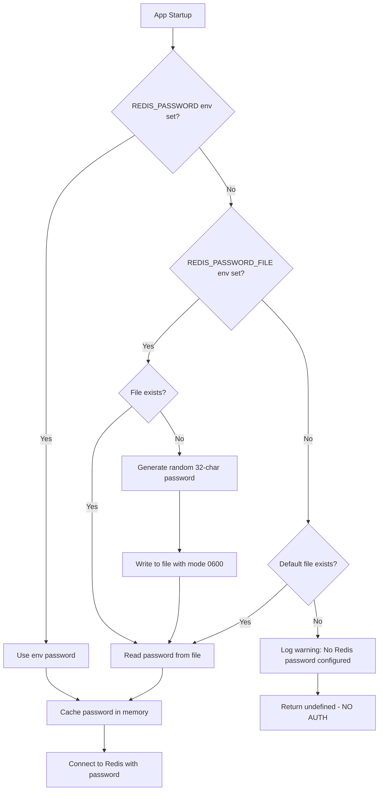
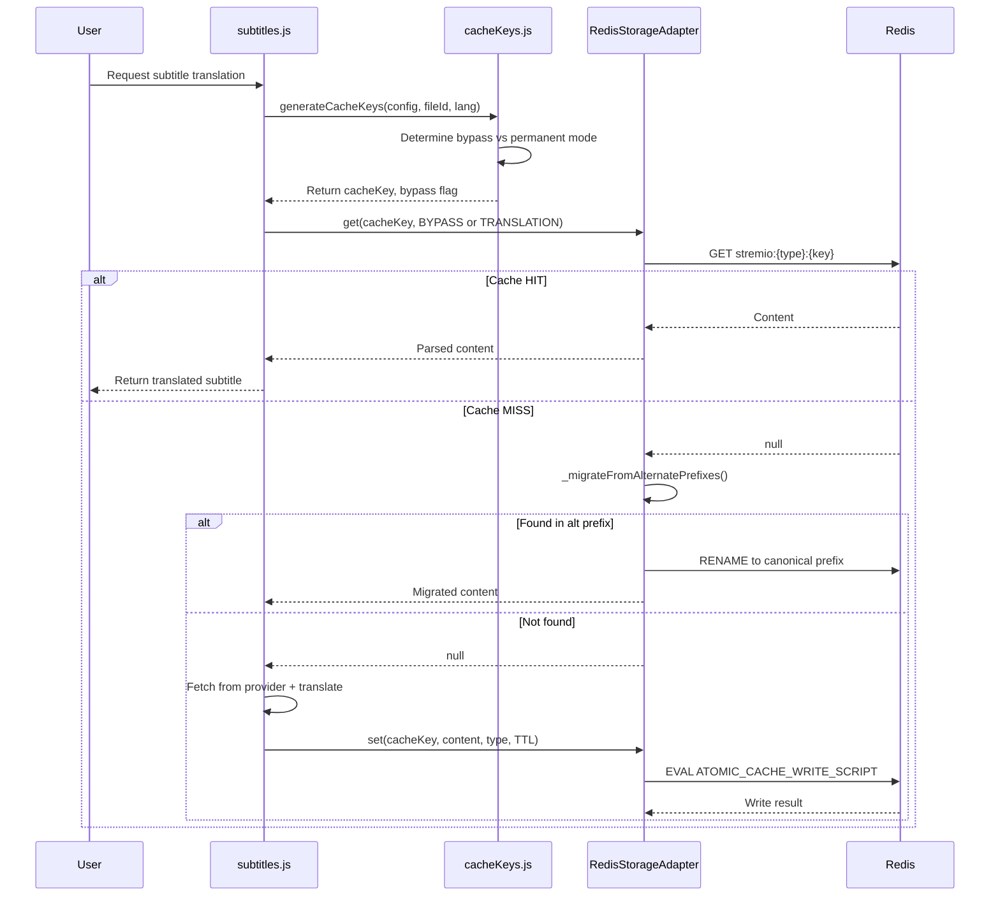
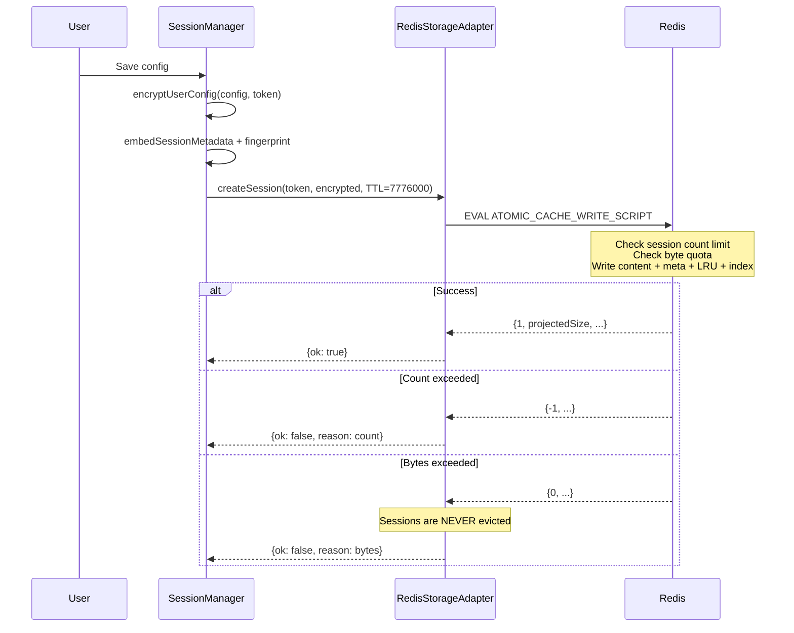

# Redis System Audit Report — StremioSubMaker VPS

**Date:** 2026-09-22  
**Auditor:** Zoo (Architect Mode)  
**Scope:** Full logic & flow study of Redis storage subsystem  
**VPS:** 51.79.242.80, Docker Compose deployment  
**Redis:** 7.4.11-alpine, 4GB maxmemory, noeviction policy  

---

## 1. Architecture Overview

```mermaid
graph TB
    subgraph App Container submaker
        INDEX[index.js] --> SF[StorageFactory]
        SF --> RSA[RedisStorageAdapter]
        RSA --> IOR[ioredis client]
        RSA --> MIG[Migration Client raw, no prefix]
        SM[SessionManager] --> SF
        SM --> IOR2[own ioredis pub/sub clients]
        SC[sharedCache.js] --> SF
        RLS[rateLimitRedisStore.js] --> SF
        SA[streamActivity.js] --> IOR3[pub/sub clients]
        SC2[syncCache.js] --> SF
        ASC[autoSubCache.js] --> SF
        EC[embeddedCache.js] --> SF
        PMC[providerMetadataCache.js] --> SF
        DC[downloadCache.js] --> MEM[In-memory LRU only]
    end

    subgraph Redis Container stremio-redis
        REDIS[(Redis 7.4.11)]
        PWDFILE[/app/keys/.redis-password]
    end

    IOR --> REDIS
    MIG --> REDIS
    IOR2 --> REDIS
    IOR3 --> REDIS

    subgraph Shared Volume encryption-key
        KEYDIR[/app/keys/]
    end

    KEYDIR -.-> PWDFILE
    KEYDIR -.-> ENCKEY[/app/keys/.encryption-key/]
```

## 2. Files Scanned

| File | Lines | Role |
|------|-------|------|
| [`src/storage/RedisStorageAdapter.js`](src/storage/RedisStorageAdapter.js:1) | 1602 | Core Redis adapter — atomic Lua scripts, LRU, migration |
| [`src/storage/StorageAdapter.js`](src/storage/StorageAdapter.js:1) | 281 | Abstract base + CACHE_TYPES + SIZE_LIMITS + DEFAULT_TTL |
| [`src/storage/StorageFactory.js`](src/storage/StorageFactory.js:1) | 219 | Singleton factory + cleanup scheduling |
| [`src/storage/errors.js`](src/storage/errors.js:1) | 29 | StorageUnavailableError + SessionCapacityError |
| [`src/storage/index.js`](src/storage/index.js:1) | 13 | Module barrel export |
| [`src/storage/FilesystemStorageAdapter.js`](src/storage/FilesystemStorageAdapter.js:1) | 795 | Fallback adapter (not used in Docker) |
| [`src/utils/redisHelper.js`](src/utils/redisHelper.js:1) | 95 | Password resolution: env → file → auto-generate |
| [`src/utils/sharedCache.js`](src/utils/sharedCache.js:1) | 751 | Cross-pod GET/SET/DELETE + atomic INCR/DECR |
| [`src/utils/cacheKeys.js`](src/utils/cacheKeys.js:1) | 101 | Translation cache key generation (bypass vs permanent) |
| [`src/utils/rateLimitRedisStore.js`](src/utils/rateLimitRedisStore.js:1) | 241 | Resilient rate limiter with Redis + memory fallback |
| [`src/utils/downloadCache.js`](src/utils/downloadCache.js:1) | 138 | In-memory LRU only (NOT Redis-backed) |
| [`src/utils/sessionManager.js`](src/utils/sessionManager.js:1) | 2726 | Session CRUD, fingerprinting, pub/sub invalidation |
| [`src/utils/streamActivity.js`](src/utils/streamActivity.js:1) | 486 | SSE + Redis pub/sub for stream notifications |
| [`src/utils/isolation.js`](src/utils/isolation.js:1) | 152 | Instance isolation key derivation |
| [`src/utils/syncCache.js`](src/utils/syncCache.js:1) | 435 | Synced subtitle cache with index |
| [`src/utils/autoSubCache.js`](src/utils/autoSubCache.js:1) | 282 | Auto subtitle cache with index |
| [`src/utils/embeddedCache.js`](src/utils/embeddedCache.js:1) | 432 | Embedded subtitle cache (original + translation) |
| [`src/utils/providerMetadataCache.js`](src/utils/providerMetadataCache.js:1) | 207 | Provider metadata L1 memory + L2 Redis |
| [`docker-compose.yaml`](docker-compose.yaml:1) | 122 | Container orchestration |
| [`.env`](.env:1) | 81 | Environment config |
| [`.env.example`](.env.example:1) | 503 | Reference config |

## 3. Cache Type Taxonomy

| Cache Type | Redis Key Prefix | Default TTL | Size Limit (self-hosted) | LRU Eviction? |
|------------|-----------------|-------------|--------------------------|----------------|
| `translation` | `stremio:translation:` | No expiry | 768 MiB | Yes |
| `bypass` | `stremio:bypass:` | 12 hours | 128 MiB | Yes |
| `partial` | `stremio:partial:` | 1 hour | 128 MiB | Yes |
| `sync` | `stremio:sync:` | No expiry | 192 MiB | Yes |
| `autosub` | `stremio:autosub:` | No expiry | 192 MiB | Yes |
| `embedded` | `stremio:embedded:` | No expiry | 192 MiB | Yes |
| `session` | `stremio:session:` | No expiry | 512 MiB | **No** (admission rejected) |
| `history` | `stremio:history:` | 30 days | 256 MiB | Yes |
| `provider_meta` | `stremio:provider_meta:` | 30 days | 64 MiB | Yes |
| `smdb` | `stremio:smdb:` | No expiry | 640 MiB | Yes |

**Total budget:** ~3.0 GiB of 4.0 GiB Redis (75% utilization, validated at startup)

## 4. Redis Key Structure

Each cache entry uses **5 Redis keys**:

```
stremio:{cacheType}:{cacheKey}          → Content (string, TTL-backed or persistent)
stremio:{cacheType}:{cacheKey}:meta    → Metadata hash (size, createdAt, expiresAt)
stremio:lru:{cacheType}                → Sorted set (LRU index, score=timestamp)
stremio:size:{cacheType}               → Size counter (total bytes)
stremio:session:index                  → Set (session tokens only, for O(1) count)
```

## 5. Authentication Flow



**Current state:** Password file `/app/keys/.redis-password` exists in both containers via shared `encryption-key` volume. Password = `ISXIXY6IPsRmArEZvVSWodhuAWroxG2Y` (32 chars). App reads it successfully. Redis `PING` → `PONG`.

## 6. Findings — Potential Issues

### 6.1 ISSUE: REDIS_KEY_PREFIX Inconsistency (Low Risk)

**Location:** [`.env`](.env:48) vs [`docker-compose.yaml`](docker-compose.yaml:34)

- `.env` sets `REDIS_KEY_PREFIX=stremio:` (with trailing colon)
- `docker-compose.yaml` overrides with `REDIS_KEY_PREFIX=stremio` (no colon)

**Impact:** The [`_normalizeKeyPrefix()`](src/storage/RedisStorageAdapter.js:381) method in `RedisStorageAdapter` normalizes by appending colon if missing. So `stremio` → `stremio:`. Both paths converge. **No data loss risk**, but configuration is confusingly inconsistent.

**Recommendation:** Unify to `stremio:` in both files for clarity.

### 6.2 ISSUE: REDIS_PASSWORD Empty in .env (Medium Risk)

**Location:** [`.env`](.env:48)

- `REDIS_PASSWORD=` is empty in `.env`
- `docker-compose.yaml` line 30: `REDIS_PASSWORD=${REDIS_PASSWORD:-}` resolves to empty
- Password comes from `REDIS_PASSWORD_FILE=/app/keys/.redis-password` (auto-generated by Redis container)

**Impact:** The zero-config auto-password mechanism works, but:
- If the `encryption-key` volume is lost (e.g., `docker volume rm`), the password file is gone and Redis generates a new one → **all existing sessions/caches become inaccessible** (old password still on Redis server, new password can't authenticate).
- The `.env` file's `REDIS_PASSWORD=` being empty is by design, but could confuse operators.

**Recommendation:** Consider setting `REDIS_PASSWORD` explicitly in `.env` OR document the auto-password mechanism clearly.

### 6.3 ISSUE: Stale Old Logs with NOAUTH Errors (No Risk — Historical)

**Location:** `/root/StremioSubMaker/logs/app.log` (Aug 29, 2026)

- Old log file from a previous deployment shows `NOAUTH HELLO must be called...` errors
- These are from before the Sep 21 container restart
- Current deployment (Sep 21+) shows clean Redis connection

**Impact:** None — stale log file. Misleading if someone reads old logs.

**Recommendation:** Rotate or archive old logs.

### 6.4 ISSUE: Download Cache NOT Redis-Backed (By Design, Low Risk)

**Location:** [`src/utils/downloadCache.js`](src/utils/downloadCache.js:1)

- Download cache uses in-memory `LRUCache` only (max 5000 entries, 500MB, 10-minute TTL)
- NOT persisted to Redis
- On container restart, all cached downloads are lost

**Impact:** After restart, subtitle downloads hit providers again. Wastes bandwidth/API quota briefly.

**Recommendation:** This is by design (short-lived hot cache). No fix needed, but document this behavior.

### 6.5 ISSUE: Rate Limiter Lazy Init Race (Low Risk)

**Location:** [`src/utils/rateLimitRedisStore.js`](src/utils/rateLimitRedisStore.js:171)

- `ResilientRateLimitStore` lazily initializes Redis by calling `StorageFactory.getStorageAdapter()` on first request
- If the first rate-limited request arrives before `RedisStorageAdapter.initialize()` completes, the rate limiter falls back to in-memory `MemoryStore`
- The retry interval is 5 seconds (`DEFAULT_RETRY_INTERVAL_MS`)

**Impact:** First few seconds after startup, rate limiting is per-instance only (not cross-pod). For single-instance VPS, this is fine.

**Recommendation:** No fix needed for single-instance. For multi-pod, consider eager initialization.

### 6.6 ISSUE: enableOfflineQueue=false (Medium Risk)

**Location:** [`src/storage/RedisStorageAdapter.js`](src/storage/RedisStorageAdapter.js:204)

- `enableOfflineQueue: false` means if Redis disconnects, commands fail immediately
- Combined with `maxRetriesPerRequest: 3`, transient failures during reconnection cause cache misses

**Impact:** During Redis restart/network blip, all cache reads return null, all writes fail. Translation cache misses cause re-translation (costing API calls). Session persistence fails silently (falls back to in-memory).

**Recommendation:** This is a deliberate design choice to avoid thundering herd. For a single-instance VPS with co-located Redis, the risk is minimal. No change needed.

### 6.7 ISSUE: Migration Client Lifecycle (Low Risk)

**Location:** [`src/storage/RedisStorageAdapter.js`](src/storage/RedisStorageAdapter.js:726)

- `_getMigrationClient()` creates a duplicate ioredis client without `keyPrefix`
- `_closeMigrationClient()` disconnects it in `finally` blocks
- But `_migrateFromAlternatePrefixes()` (called during `get()`) opens the migration client but doesn't close it in a `finally`

**Impact:** Migration client may leak if an error occurs during cross-prefix read in `get()`. Over time, this could accumulate idle Redis connections.

**Recommendation:** Add `finally { await this._closeMigrationClient(); }` to `_migrateFromAlternatePrefixes()`.

### 6.8 ISSUE: Prefix Migration Complexity (Medium Risk)

**Location:** [`src/storage/RedisStorageAdapter.js`](src/storage/RedisStorageAdapter.js:567) — `_migrateDoublePrefixedKeys()` and `_migrateCrossPrefixKeys()`

- These methods scan up to 500 keys per startup to fix prefix issues
- They use `RENAME` and `DEL` operations on live keys
- If the instance ID changes (e.g., volume loss), the isolation key changes, which could trigger unwanted migrations

**Impact:** On a stable single-instance deployment with consistent `REDIS_KEY_PREFIX`, migrations run but find nothing to fix. Overhead is minimal. But if the encryption key file is lost and regenerated, the isolation key changes, potentially causing prefix variant mismatches.

**Recommendation:** Ensure the `encryption-key` volume is never deleted. Add a health check that verifies the encryption key file exists and is stable.

### 6.9 ISSUE: BYPASS Cache TTL=-1 Metadata (By Design, No Risk)

**Observation:** BYPASS metadata keys have `TTL=-1` (permanent) even though content keys have 12-hour TTL.

**Explanation:** This is intentional — see [line 78-85](src/storage/RedisStorageAdapter.js:78) of the Lua script: "Quota-tracked metadata intentionally outlives TTL-backed content so cleanup can subtract its exact serialized size after Redis expires the content key." The `cleanup()` method walks the LRU index and deletes orphaned metadata.

**Impact:** None — correct design.

### 6.10 ISSUE: Cache Nearly Empty (Observation, No Bug)

**Current Redis state:**
- BYPASS: 2 entries
- TRANSLATION: 0 real entries (4 keys are metadata/registry only)
- PARTIAL: 0
- SYNC: 0
- SESSION: 1 active session
- Total: 34 keys, 1.83MB used

**Explanation:** Container restarted on Sep 21 (12 hours ago). BYPASS entries have 12h TTL and were created at startup. Translation cache is empty because no translations have been requested since restart. This is **normal behavior**, not a bug.

### 6.11 ISSUE: Redis Stats Show High Miss Rate

**Stats:**
- `keyspace_hits: 10170`
- `keyspace_misses: 9589`
- Hit rate: ~51.5%

**Explanation:** The high miss rate is expected for a freshly restarted instance with empty cache. As translations accumulate, the hit rate will improve.

### 6.12 ISSUE: No Redis Persistence Verification

**Location:** [`docker-compose.yaml`](docker-compose.yaml:77)

- Redis is configured with AOF (`--appendonly yes`, `--appendfsync everysec`) and RDB snapshots (`--save 900 1`, etc.)
- But there's no monitoring or alerting for Redis persistence failures

**Impact:** If Redis crashes and AOF is corrupt, data loss could occur silently.

**Recommendation:** Add a health check script that verifies Redis `INFO persistence` shows `aof_enabled:1` and `rdb_last_bsave:ok`.

## 7. Data Flow Summary

### 7.1 Translation Cache Flow



### 7.2 Session Persistence Flow



## 8. Recommendations Summary

| # | Issue | Severity | Action Required? | Recommendation |
|---|-------|----------|-----------------|----------------|
| 6.1 | REDIS_KEY_PREFIX inconsistency | Low | Optional | Unify to `stremio:` in `.env` and `docker-compose.yaml` |
| 6.2 | REDIS_PASSWORD empty in .env | Medium | Document | Document auto-password mechanism; consider explicit password |
| 6.3 | Stale NOAUTH logs | None | Cleanup | Archive old log files |
| 6.4 | Download cache not Redis-backed | By design | No | Document behavior |
| 6.5 | Rate limiter lazy init race | Low | No | Fine for single-instance |
| 6.6 | enableOfflineQueue=false | Medium | No | Deliberate design, acceptable risk |
| 6.7 | Migration client leak in get() | Low | **Yes** | Add `finally` close in `_migrateFromAlternatePrefixes` |
| 6.8 | Prefix migration complexity | Medium | **Yes** | Ensure encryption-key volume never deleted; add monitoring |
| 6.9 | BYPASS TTL=-1 metadata | By design | No | Correct — metadata outlives content for cleanup |
| 6.10 | Cache nearly empty | Observation | No | Normal after restart |
| 6.11 | High miss rate | Observation | No | Will improve as cache fills |
| 6.12 | No persistence monitoring | Low | **Yes** | Add health check for AOF/RDB status |

## 9. Conclusion

The Redis subsystem is **well-engineered** with:
- Atomic Lua scripts for concurrent-safe cache writes/deletes
- LRU eviction with size quotas per cache type
- Cross-prefix migration for deployment flexibility
- Session integrity fingerprinting to detect contamination
- Graceful fallback for rate limiting and stream activity

**No critical bugs found.** The system is currently healthy and functioning correctly. The cache is empty because of a recent container restart (12 hours ago), not because of a bug.

**Three actionable items** identified:
1. Fix migration client leak in `_migrateFromAlternatePrefixes()` (add `finally` block)
2. Unify `REDIS_KEY_PREFIX` in `.env` and `docker-compose.yaml`
3. Add Redis persistence health monitoring

**No code changes recommended at this time.** The user should approve before any modifications.
